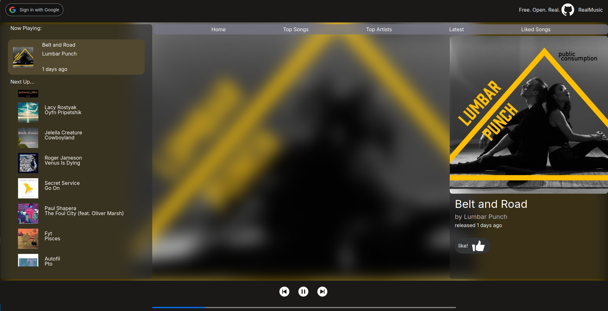

# RealMusic

contact : realmusic.open.player@gmail.com

### Open source music player

Many indie songs published to streaming services receive little to no attention, and often next to no streams. RealMusic provides an unfiltered stream to the indie underworld, promoting each song equally and aiming to restore a merit based system which has been corrupted by large algorithms favouring popular artists.

RealMusic is an open-source indie music player and discovery site. RealMusic scrapes and serves the latest indie songs, updated every hour.

### How it Works

When indie artists publish songs to streaming sites such as spotify, apple music and youtube, they go through an online distribution service such as CDbaby or DistroKid. RealMusic finds these published songs through the unique distributor tag, and serves them through an embedded youtube player.

### Tech-Stack

#### Frontend

    Next.JS hosted on vercel

    - TypeScript
    - styled with CSS

#### Backend

    AWS serverless Lambda functions

    - TypeScript
    - Prisma
    - NextAuth

#### Song Selection Engine

The site was made with future improvements in mind. The song recommendation system (currently random) was created with Python for possible future AI integration to categorize songs.

    AWS serverless python function
    - Docker Deployment
    - SQLAlchemy

#### Data Base

    PostgreSQL database
